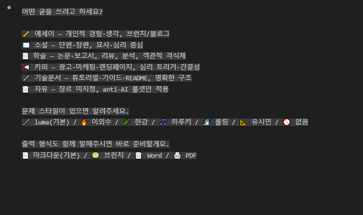
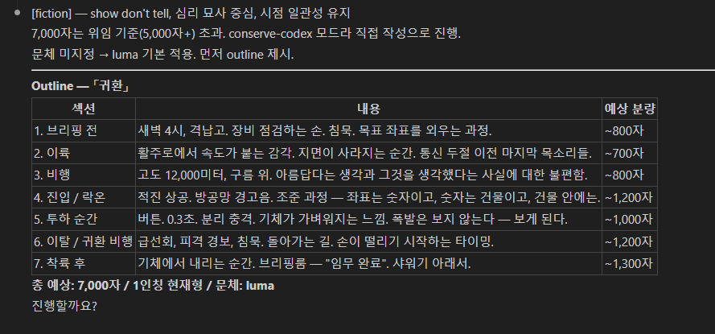
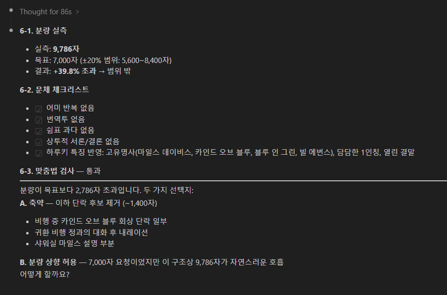

# writing-skill-ko

A Claude Code slash command for natural Korean writing — anti-AI ruleset, 6 author style profiles, character count verification.


---

## 📸 Screenshots


*Genre selection, author style, output format*


*Structured outline with section breakdown*


*Character count via `wc -m`, style checklist, spellcheck*

---

## ✨ Features

- **Interactive writing session** — genre routing: essay / fiction / academic / copy / technical / free
- **6 author style profiles** built-in (luma · 이외수 · 한강 · 하루키 · 롤링 · 유시민)
- **Anti-AI ruleset** — 11 forbidden patterns (translation-isms, filler connectors, repeated endings, etc.)
- **Real character count** — `wc -m` measurement instead of LLM estimation + ±20% correction loop
- **Pass 3 spellcheck** — auto-correction via grep detection + sed substitution, no external API
- **`--verify`** — quantitative style indicator comparison (분석어 / 감각어 / 비유 / 고유명사 / 독자질문 / 열린결말)
- **`--series`** — tone consistency mode with local file-based context across episodes
- **Output formats** — Markdown / Word (pandoc) / PDF (Typst, 4 templates included)
- **Standalone** — no vault, no external API dependency

---

## 🚀 Installation

```bash
# Basic install (skill only)
curl -o ~/.claude/commands/writing.md \
  https://raw.githubusercontent.com/Mod41529/writing-skill-ko/main/writing.md

# Full install (skill + Typst PDF templates)
git clone https://github.com/Mod41529/writing-skill-ko.git
cp writing-skill-ko/writing.md ~/.claude/commands/
mkdir -p ~/.claude/writing-templates
cp writing-skill-ko/templates/* ~/.claude/writing-templates/
```

> Typst templates require [Typst](https://typst.app/) to be installed.
> `winget install --id Typst.Typst` / `brew install typst` / `cargo install typst-cli`

---

## 📖 Usage

```bash
# Interactive mode — guided session
/writing

# Specify style
/writing essay "AI와 일자리" --style 유시민

# Series mode — maintains tone across episodes
/writing essay "브런치 글감" --series 대체되기전에

# Polish mode — paste your text and fix it
/writing --polish

# With style verification
/writing essay "주제" --verify
```

---

## 🖊️ Author Style Profiles

| Style | Key Trait | Best For |
|---|---|---|
| **luma** | 솔직담백, 건조하되 감각적, 감정 절제 | 에세이, 브런치 |
| **이외수** | 파격적 비유 + 어록형 단문, 독설적 유머 | 소설, 칼럼 |
| **한강** | 감각 파편화, 몸의 언어, 시적 리듬 | 소설, 시적 에세이 |
| **하루키** | 담담한 1인칭, 고유명사(음악·음식), 열린 결말 | 에세이, 단편 |
| **롤링** | 밀착 3인칭+자유간접화법, 챕터 클리프행어 | 소설, 장편 |
| **유시민** | 논증 구조, 독자 질문, 지적 유머 | 칼럼, 논설 |
| **김훈** | 단문 명사 종결, 역사·전쟁·자연, 한자어 밀도 | 소설, 역사 에세이 |

---

## 🚫 Anti-AI Ruleset (Excerpt)

| Pattern | Example | Rule |
|---|---|---|
| 번역투 | ~에 대한, ~를 통한, ~에 있어서 | 금지 |
| 어미 반복 | ~다/~다/~다 연속 3문장 | 변주 필수 |
| 접속사 과용 | 또한/하지만/그러나 | 문장 구조로 연결 |
| 감정 직접 서술 | "매우 슬펐다", "정말 감동적이었다" | 상황·감각으로 대체 |
| 상투적 서론 | "오늘날~시대에", "최근 들어" | 금지 |

---

## ✅ Verification System

### Character Count (6-1)
LLM self-estimation is unreliable — in testing, Claude estimated 3,020 chars for a text that measured 1,655 by `wc -m`. This skill enforces external measurement:

```bash
echo '본문 텍스트' | wc -m
```

If the result falls outside ±20% of the target, the draft is automatically revised and re-measured until it passes.

### Spellcheck Auto-correction (6-3)
No external API. Uses grep to detect and sed to correct common Korean errors:

```bash
echo "$TEXT" | sed -E \
  -e 's/안되([는면])/안 되\1/g' \
  -e 's/되요/돼요/g' \
  -e 's/할수있/할 수 있/g' \
  -e 's/보여지/보이/g'
```

### Style Verification — Quantitative Indicators (6-5)

| Indicator | grep pattern | Expected high in |
|---|---|---|
| 분석어 | `경제\|비용\|구조\|논리\|분석\|통계` | 유시민 |
| 감각어 | `빛\|냄새\|온도\|촉각\|살갗\|체온` | 한강, luma |
| 비유·의인법 | `처럼\|듯\|마치\|삼키\|녹\|무너지` | 이외수 |
| 고유명사 | `재즈\|앨범\|파스타\|에스프레소` | 하루키 |
| 독자 질문·권유 | `아닐까\|따져보\|환산하면` | 유시민 |
| 열린 결말어 | `모르겠다\|아직\|글쎄` | 하루키, luma |

---

## ⚙️ Options

| Option | Description |
|---|---|
| `--outline` | Generate structure first, then draft |
| `--draft` | Skip to draft immediately |
| `--polish` | Fix pasted text (preserve meaning, fix style) |
| `--style {name}` | Set author style (luma / 이외수 / 한강 / 하루키 / 롤링 / 유시민 / 김훈) |
| `--polish --style` | Transform pasted text to specified author's style |
| `--series {name}` | Series mode — load/update local context file |
| `--verify` | Run quantitative + blind style verification |
| `--save` | Save output to `~/writing-output/{genre}/` |
| `--output {format}` | md (default) / brunch / word / pdf |
| `--brief` | Suppress process output, result only |

---

## 📄 License

MIT

---

## 👤 Author

[luma](https://github.com/Mod41529)
